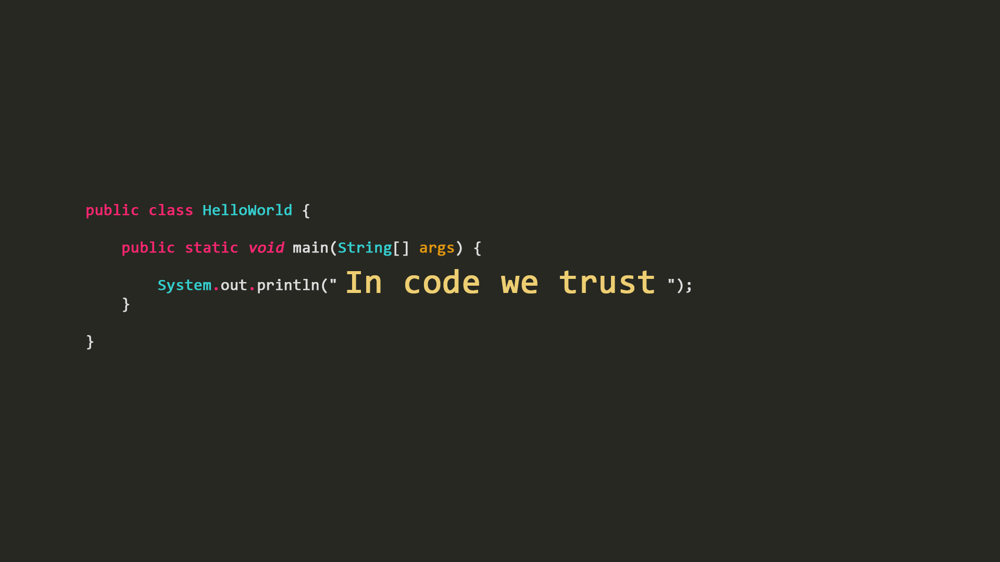

## Reflections on days past and new understandings

I remember when I first started this class. My understanding of coding was still on a rather basic level as my skills were, up to this point, limited to making small, rudimentary programs for the sake of turning in assignments, with the exception of final projects and outside projects from before my time at UH. At first, reading the schedule, materials, and expectations of this course, I had brushed it off as just a web design course that, at miminum, would help me brush up on my coding skills. But as I went through this course and looked deeper into what the course was teaching, I began to see just how much depth there was to proper software development, and concepts such as coding standards and functional programming helped to deepen that understanding even more.

### Raising the standard

Coding standards, which are specific guidelines and conventions for use during coding, had been a relatively unknown subject to me at the time of learning about it. Before, my coding was usually fraught with numerous errors and irregular formatting that made it hard to read, especially after spending a long time not looking at it. However, implementing coding standards has helped to drastically clean up my code and make it presentable. Beyond helping me with the web design projects we did over the course of this class, however, coding standards will help me better collaborate with other people during other projects by ensuring an easily readable coding experience and minimalizing the amount of bug that crop up during coding and testing.

### Functions for functions

Functions, which are blocks of code designed to perform specific tasks and for ease of modularity, have been something that I've had some amount of experience with before but I've never used them to this extent, especially imported function libraries such as Underscore and React. After having used them for the better part of this semester, I've grown a liking to them and see a lot of potential outside of webdevelopment. Libraries like Underscore are especially useful with how they expedite and simplify reading and writing lists and arrays and I often found myself experimenting with it in my free time. In all, going deeper into functional programming has helped me better understand how to best utilize functions for my coding projects, which will prove especially useful in the coming years.

### A future in code?

With the final weeks now being left behind, I can't help but look back on this class fondly. Yes, I had my fair share of struggles and tribulations, especially with the in-class timed WODs, but I also felt like I learned quite a bit about software engineering and improved my ability to code properly. I know that there isn't a future within web design for me, but I know I can definitely apply these skills that I've learned for purposes outside of not just web design, but even outside of software engineering.
