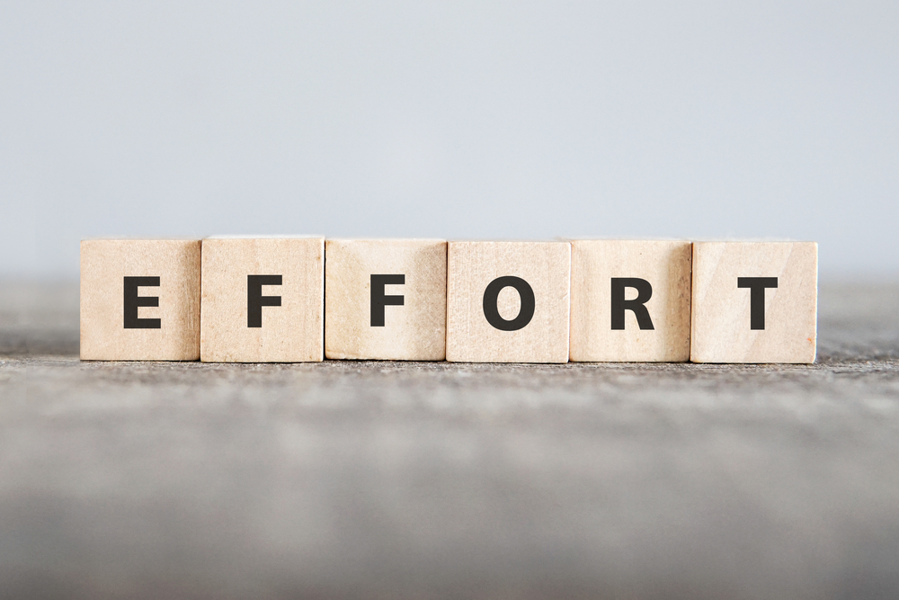

## For Efficiency's Sake
During my final project to build a club tracking website, I undertook the task to log my efforts via a tracker spreadsheet on Github. This was done to see how efficiently I was working and to see what methods of working worked and what didn't work. By the end of the project, however, I felt that the effort tracker was a mixed experience for me personally. While initially it helped to keep track of how much I'm doing and how I can do better, it started to become just another goal post like the milestones.
 
### Tracking Time and Effort
Initially, the effort tracker helped to show me how to better optimize the time I spent on an issue, with the estimation serving as a goal for me to hit during my work. This tracking proved especially for M2, which was where the bulk of my work was done. I found that overestimating the effort needed helped to temper my expectations even for seemingly simple problems, and then witnessing the actual amount of effort needed for each issue made it seem like I was starting to become more efficient.

### Souring Effort
Eventually, however, I began to see it giving less dividends than before, as I soon began to see it as merely another goalpost for me to consider. Often did I look at the effort estimation and gave it little to no thought duirng the latter half of our project, and soon I began to rely on it less and less. But at the same time, I found that the efficiency I had gained waned only a little. This had led me to believe that the effort tracking was best served as a platform for me to better my time management and efficiency, and once I had done so at a satisfactory level, I relied less and less on it.

### Efforts For Efficiency
Still, I do believe that this effort tracking and estimation helped to better improve my efficiency and time management when it comes to big projects such as these. Though I found it less useful later on, it still proved its worth in the end and I will endeavor to continue my improvements.
