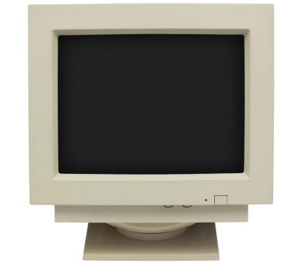

## Where it all began

I've been using computers for my entire life. My oldest computer was one of those old-timey Hewlett-Packard desktops with those old bulky CRT monitors, a clacky and clunky office keyboard, and a mouse with just the left and right mouse button along with the scroll wheel. Then I changed it out for a more recent laptop running Windows Vista and used it as my main compute of choice until I began high-school, where I then assembled my own mid-tower desktop using a mixture of parts from my father's older Alienware desktop and some mid-grade parts ordered from Newegg. That computer is still in use today by my younger brother but I'd moved on to this bulky but powerful gaming laptop once I decided to pursue a career in the world of computer science.

### The choices made

I wanted to get a career working with computers ever since I started high school and I started looking around for what may suit my fancy. I initially thought of becoming a game developer due to my love of video games since my earliest childhood days, but decided against it in the end as I found that, despite my enthusiam, coding programs was not my forte. Then I started leaning into networking and systems administration, possibly even getting into systems engineering and working with tools such as Active Directory. But it wasn't until halfway through my time at DevLeague when I decided to go into the world of information security, and from that point on, my efforts became concentrated on securing my place in that field. So then, if software engineering isn't my interest, then why would this class matter to me?

### Looking to the future

While programming isn't something that I expect to be doing in my potential line of work, it's a good idea to branch out and learn new skills or refine old ones, which is, in my case, software engineering. Though, learning Javascript and all it can do isn't necessarily a primary focus of mine for this class, although I do count it as a bonus. Rather, I want to learn more about the development process when it comes to engineering and how I could apply that to not just my field of work, but also in my interactions with any developers who may want me to test a product of theirs. While the gains of learning software engineering won't be as apparent at first, in the future, I believe it will grant me great insight the next time someone asks me to review and test a security product of theirs.
