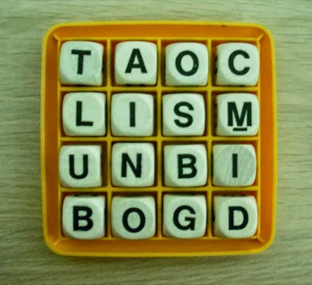

I was experimenting with using the binary search method during my time at DevLeague when I got the idea to try to make a game based off of the game called Boggle, which is a word game based around trying to come up with as many words as they could from a set of letters that were handed to them. This was an especially lengthy project as not only was I coding multiple functions and had to learn some others that I had imported for the purposes of this project, this was also a solo project with no other collaborators. Eventually, I completed the game, and after several rounds of vigorous testing and ironing out any bugs or issues, I was greatly satisfied with the end product.

The main parts of this project revolve around the Boggle and Boggle_AI files, where I generated a random list of letters from a pool of them and had players try to combine them into a variety of words that were imported from a lexicon that I had the BoggleI file read in. The Boggle_AI file then built a list of words for the game to check the player's input against and assigned points accordingly, ending after 3 minutes. In order to be able to keep track of any words that players inputted, I also made use of arrays, which required some reading during the development process.

Overall, this project was an interesting one, as I had made use of a lot of new techniques and functions to accomplish making the game I wanted. While there were a lot of stumbles and roadblocks during the development, I felt like I learned a lot about testing and bug-fixing during my trial-and-error with this game, along with learning how to use binary search methods for searching for words to use.

Source: <a href="https://github.com/TristanYousufLeo/Boggle/blob/master/Main.py"><i class="large github icon "></i>TristanYousufLeo/Boggle</a>
