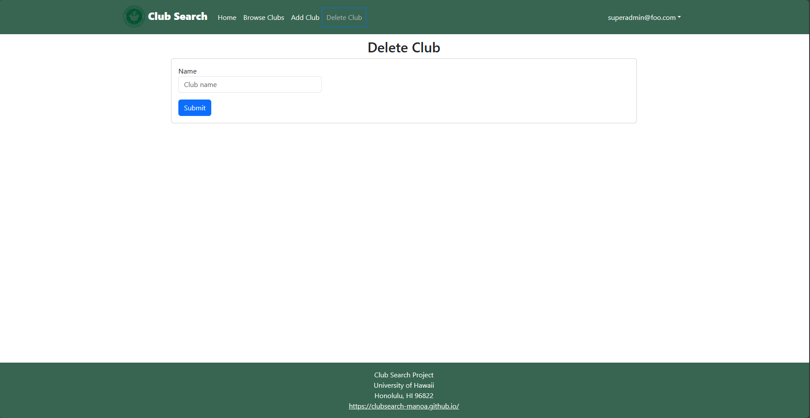

For our final project of ICS 314, we were tasked with the creation of a website where students could browse for the various clubs of UH Manoa and quickly get in touch with them if desired. This project was my biggest one yet, as I had to collaborate with four other group members, each with different jobs. After many days of hard work, our project was completed and tested using five testers from within the UH community. This was the culmination of what we had learned over this semester from ICS 314 and demonstrates our newly acquired coding skills and techniques.

For my part, I had implemented the ability for a super admin to delete a club from the database and assisted in setting up test pages for use with testcafe. For the deletion of clubs, I had to write up a new method that removed any club that matched the input I used, which was the name of the club. Using the name as the reference, the method would remove everything associated with that club from the database. That was the easy part. Getting it to work on a webpage proved harder as I had to learn schemas to make it submit the data to the method without breaking the database accidentally. For the testing, that also proved to be relatively easy as we were able to use the tests already made for the template we used as a reference rather then having to create if from scratch. This, however, resulted in some easily missable problems such as the wrong accounts being used for testing as well as the lack of testing for goto pages for the new methods.

This project was definitely stressful but also satisfying as well. I had plenty of moments where I wanted to scream in frustration when the deletion method, well, didn't delete and when the tests kept failing one after the other, but the satisfaction from finally identifying and fixing the issues and then seeing them work was immense. I learned a lot about collaborative development and better coding practices from this project and I look forward to putting them to good use in the near future.

Source: 
